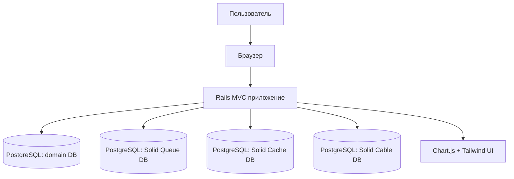

# Архитектура приложения (по всей кодовой базе)

## 1. Назначение

Приложение реализует вычислительный стенд для курсовой работы по ТИЗИ:

- моделирование профилей атак (линейный/экспоненциальный);
- расчёт вероятностей обнаружения уязвимостей (одиночный и коллаборационный режимы);
- учёт противодействия тестированию;
- генерация матрицы смежности `15x15` и поиск покрытия жадным алгоритмом;
- визуализация результатов и формирование справочных методических данных.

## 2. Технологический стек

- Backend: Ruby 3.4 + Rails 8 (`actionpack`, `activerecord`, `actionview`)
- БД: PostgreSQL
- Frontend: ERB + Tailwind CSS + Hotwire (Turbo/Stimulus)
- Графики: Chart.js (через собственный helper `chart_canvas`)
- Тестирование: Minitest + system tests (Capybara + Selenium)
- Контроль качества: RuboCop, Brakeman, GitHub Actions CI
- Деплой: Docker + Kamal

## 3. Контекстная схема

## 4. Архитектурный стиль

Приложение построено как классическое Rails MVC с выделенным сервисным слоем:

- `Model` хранит доменные сущности и ограничения;
- `Controller` управляет CRUD-сценариями и подготовкой данных для представлений;
- `Service` инкапсулирует формулы, расчёт экспериментов и генерацию структур графа;
- `View` отображает расчёты и графики;
- `Helper` формирует конфигурации графиков и рендерит canvas.

## 5. Структура кодовой базы

- `app/models` — доменная модель (`Attack`, `Experiment`, `ExperimentResult`, `AdjacencyMatrix`, `MatrixEdge`)
- `app/controllers` — веб-слой (`AttacksController`, `ExperimentsController`)
- `app/services` — вычислительная логика и методический слой
- `app/views` — UI для разделов атак и экспериментов
- `app/helpers` — инфраструктурный helper для Chart.js
- `app/javascript` — инициализация Turbo/Stimulus
- `config` — маршруты, окружения, Puma, DB и deploy-конфигурация
- `db` — миграции и схемы (основная + `queue/cache/cable`)
- `test` — unit/controller/system tests и фикстуры
- `docs` — методические и отчётные материалы

## 6. Доменные подсистемы

### 6.1 Подсистема атак

Роли:

- хранение параметров `a`, `b`, `attack_type`;
- вычисление `pA(t)` по выбранной модели;
- классификация уровня отказа (низкий/средний/высокий).

Класс: `Attack`.

### 6.2 Подсистема экспериментов

Роли:

- хранение параметров запуска (`p_single`, `p_ai`, `n`, `k`, привязка к атаке);
- запуск пересчёта результатов при `create/update`;
- хранение временных рядов расчётов `t=1..17`;
- хранение матрицы смежности и покрытия.

Классы: `Experiment`, `ExperimentResult`, `AdjacencyMatrix`.

### 6.3 Подсистема вероятностных расчётов

Роли:

- `P(p(t))` (геометрическая модель);
- `P(p(t,k))` (биномиальная модель);
- корректировка вероятностей с учётом противодействия.

Класс: `ProbabilityService`.

### 6.4 Подсистема методических справочных данных

Роли:

- генерация эталонных рядов (6 профилей);
- таблица классификации по `t=1..17`;
- таблицы/серии по вариантам методички (включая 2, 5, 9);
- построение grid `n=1..8`, `k=1..5`.

Класс: `MethodologyReportService`.

### 6.5 Подсистема графовой генерации

Роли:

- генерация матрицы `15x15` с ограничением числа связей `[1;6]` в строке;
- дополнительное обеспечение покрытия всех столбцов;
- жадный поиск покрытия.

Классы: `MatrixGenerator`, `GreedyCover`.

## 7. Карта основных классов

- `Attack`: формулы линейной/экспоненциальной атаки, `probability_at(t)`
- `Experiment`: параметры сценария, валидация диапазонов, связь с атакой
- `ExperimentResult`: срез результатов для одного `t`
- `AdjacencyMatrix`: JSON-контейнер матрицы и покрытия
- `MatrixEdge`: отдельная сущность ребра (в текущем потоке расчёта не заполняется)
- `ExperimentRunner`: orchestration полного пересчёта эксперимента в транзакции
- `ProbabilityService`: чистые математические функции
- `MethodologyReportService`: справочные таблицы/ряды для UI
- `MatrixGenerator`: генерация случайной матрицы по ограничениям
- `GreedyCover`: выбор строк для покрытия столбцов

## 8. Поток выполнения ключевого сценария

Сценарий: пользователь создаёт/обновляет эксперимент.

1. `ExperimentsController#create|update` сохраняет `Experiment`.
2. После успешного сохранения вызывается `ExperimentRunner.new(@experiment).run`.
3. `ExperimentRunner` в транзакции:
   - удаляет старые `experiment_results`;
   - удаляет старую `adjacency_matrix`;
   - на каждом `t` из `1..17` считает:
     - `p_attack`;
     - `p_single`, `p_collab`;
     - `p_fail = p_ai * p_attack`;
     - `p_single_counter`, `p_collab_counter`;
   - сохраняет 17 записей `ExperimentResult`;
   - генерирует матрицу + покрытие;
   - сохраняет `AdjacencyMatrix(data: { matrix:, cover: })`.
4. `ExperimentsController#show` читает рассчитанные данные и готовит series для графиков.
5. `ApplicationHelper#chart_canvas` формирует конфиг Chart.js и рендерит графики.

## 9. Веб-слой и маршрутизация

Маршруты:

- `root -> attacks#index`
- `resources :attacks`
- `resources :experiments`
- health-check: `/up`

Контроллеры реализуют стандартный CRUD и не содержат формул; вычисления вынесены в сервисы.

## 10. UI и фронтенд

- Основные экраны: списки/формы/детали атак и экспериментов
- Графики строятся на стороне клиента через `Chart.js`
- Turbo включён для ускорения переходов
- Stimulus подключён, но для графиков в проекте основная инициализация делается через helper-скрипт в шаблоне
- Tailwind используется для всех компонент интерфейса

## 11. Данные и персистентность

В проекте фактически используются 4 схемы PostgreSQL:

- `db/schema.rb` — доменная БД приложения;
- `db/queue_schema.rb` — служебные таблицы Solid Queue;
- `db/cache_schema.rb` — служебная таблица Solid Cache;
- `db/cable_schema.rb` — служебная таблица Solid Cable.

Подробная структура основной БД вынесена в отдельный документ: `docs/database_schema.md`.

## 12. Окружение и эксплуатация

- Локальный запуск: `Procfile.dev` (`web`, `js --watch`, `css --watch`)
- Сервер: Puma
- Продакшен-профиль:
  - включены `solid_cache`, `solid_queue`, `solid_cable`;
  - SSL и logging в STDOUT;
  - deploy-конфиг через Kamal (`config/deploy.yml`).

## 13. Тестовая архитектура

Покрытие на уровне типов тестов:

- model tests: расчёты и валидации домена;
- service tests: соответствие формул и методическим таблицам;
- controller tests: CRUD-маршруты;
- system tests: базовые пользовательские сценарии UI.

CI (`.github/workflows/ci.yml`) выполняет:

- security scan (`brakeman`),
- lint (`rubocop`),
- тесты (`bin/rails db:test:prepare test test:system`) с PostgreSQL-сервисом.

## 14. Архитектурные особенности текущей версии

- Связь `Experiment -> Attack` реализована через FK `attacks_id` (историческое именование, а не `attack_id`).
- `MatrixEdge` присутствует в схеме, но расчёт эксперимента хранит матрицу в JSON (`adjacency_matrices.data`) и не создаёт записи в `matrix_edges`.
- `MethodologyReportService` хранит таблицы коэффициентов и правил вариантов в коде как константы.

