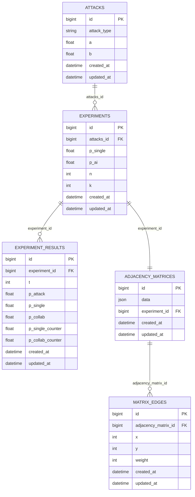

# Схема базы данных

## 1. Назначение

Документ фиксирует фактическую структуру БД текущего проекта по состоянию `db/schema.rb`, а также кратко описывает служебные схемы Rails (`queue/cache/cable`).

## 2. Доменная схема (`db/schema.rb`)

### 2.1 ER-диаграмма



### 2.2 Таблицы и поля

#### `attacks`

- `id` (PK)
- `attack_type` (`string`)
- `a` (`float`)
- `b` (`float`)
- `created_at`, `updated_at`

Индексы:

- стандартный PK по `id`.

#### `experiments`

- `id` (PK)
- `attacks_id` (`bigint`, FK -> `attacks.id`, `NOT NULL`)
- `p_single` (`float`)
- `p_ai` (`float`)
- `n` (`integer`)
- `k` (`integer`)
- `created_at`, `updated_at`

Индексы:

- `index_experiments_on_attacks_id`.

#### `experiment_results`

- `id` (PK)
- `experiment_id` (`bigint`, FK -> `experiments.id`, `NOT NULL`)
- `t` (`integer`)
- `p_attack` (`float`)
- `p_single` (`float`)
- `p_collab` (`float`)
- `p_single_counter` (`float`)
- `p_collab_counter` (`float`)
- `created_at`, `updated_at`

Индексы:

- `index_experiment_results_on_experiment_id`.

#### `adjacency_matrices`

- `id` (PK)
- `data` (`json`)
- `experiment_id` (`bigint`, FK -> `experiments.id`, `NOT NULL`)
- `created_at`, `updated_at`

Индексы:

- `index_adjacency_matrices_on_experiment_id`.

Фактический формат `data` в приложении:

```json
{
  "matrix": [[0, 1, 0, "..."], ["..."], ["..."]],
  "cover": [0, 4, 9]
}
```

Где:

- `matrix` — матрица смежности `15x15`;
- `cover` — список индексов строк, выбранных жадным алгоритмом покрытия.

#### `matrix_edges`

- `id` (PK)
- `adjacency_matrix_id` (`bigint`, FK -> `adjacency_matrices.id`, `NOT NULL`)
- `x` (`integer`)
- `y` (`integer`)
- `weight` (`integer`)
- `created_at`, `updated_at`

Индексы:

- `index_matrix_edges_on_adjacency_matrix_id`.

Примечание:

- в текущем расчётном пайплайне `ExperimentRunner` матрица сохраняется в `adjacency_matrices.data`, а записи в `matrix_edges` не создаются.

## 3. Ограничения и целостность

FK-ограничения в основной схеме:

- `experiments.attacks_id -> attacks.id`
- `experiment_results.experiment_id -> experiments.id`
- `adjacency_matrices.experiment_id -> experiments.id`
- `matrix_edges.adjacency_matrix_id -> adjacency_matrices.id`

Каскадные удаления на уровне моделей:

- `Experiment` удаляет связанные `experiment_results` и `adjacency_matrix`;
- `AdjacencyMatrix` удаляет связанные `matrix_edges`.

## 4. Логика наполнения таблиц

1. Пользователь создаёт `Attack`.
2. Пользователь создаёт `Experiment`, выбирая `attacks_id`.
3. `ExperimentRunner` пересчитывает результаты:
   - создаёт 17 строк в `experiment_results` (`t=1..17`);
   - создаёт одну строку в `adjacency_matrices`.
4. При обновлении эксперимента старые результаты удаляются и пересоздаются.

## 5. Служебные схемы Rails

Помимо доменной схемы проект включает служебные таблицы:

- `db/queue_schema.rb` — таблицы Solid Queue (`solid_queue_jobs`, `solid_queue_ready_executions`, и др.);
- `db/cache_schema.rb` — таблица Solid Cache (`solid_cache_entries`);
- `db/cable_schema.rb` — таблица Solid Cable (`solid_cable_messages`).

Эти схемы используются инфраструктурой Rails 8 и не относятся к прикладной математической модели экспериментов.

## 6. Замечания по текущему дизайну

- Поле связи `attacks_id` исторически именовано во множественном числе; в доменной модели это `belongs_to :attack`.
- Для аналитических запросов по времени может быть полезен составной индекс `(experiment_id, t)` в `experiment_results`.
- Если планируется хранить/обрабатывать рёбра отдельно, нужно синхронизировать `adjacency_matrices.data` и `matrix_edges`.

